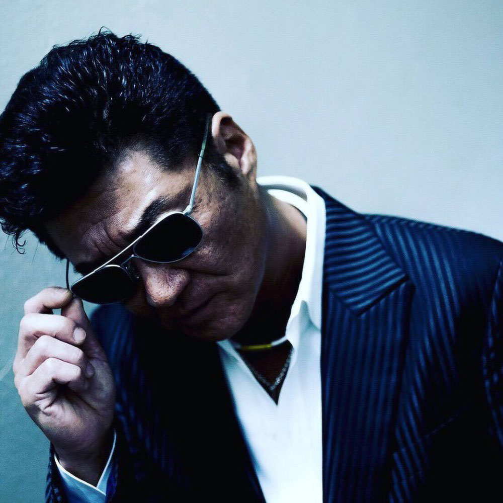
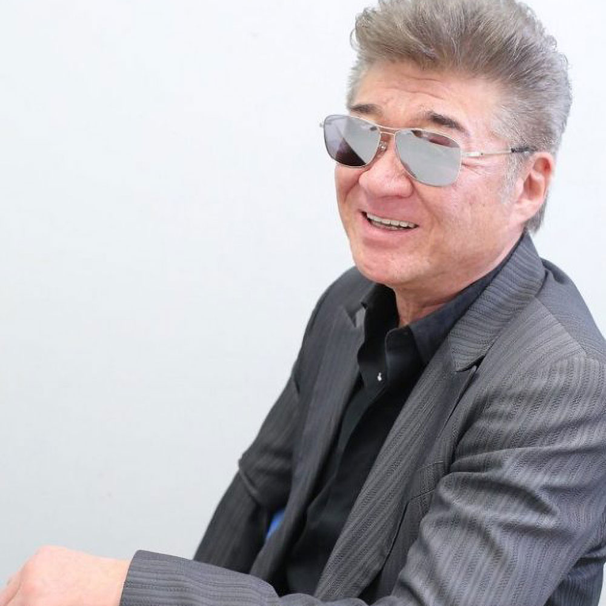
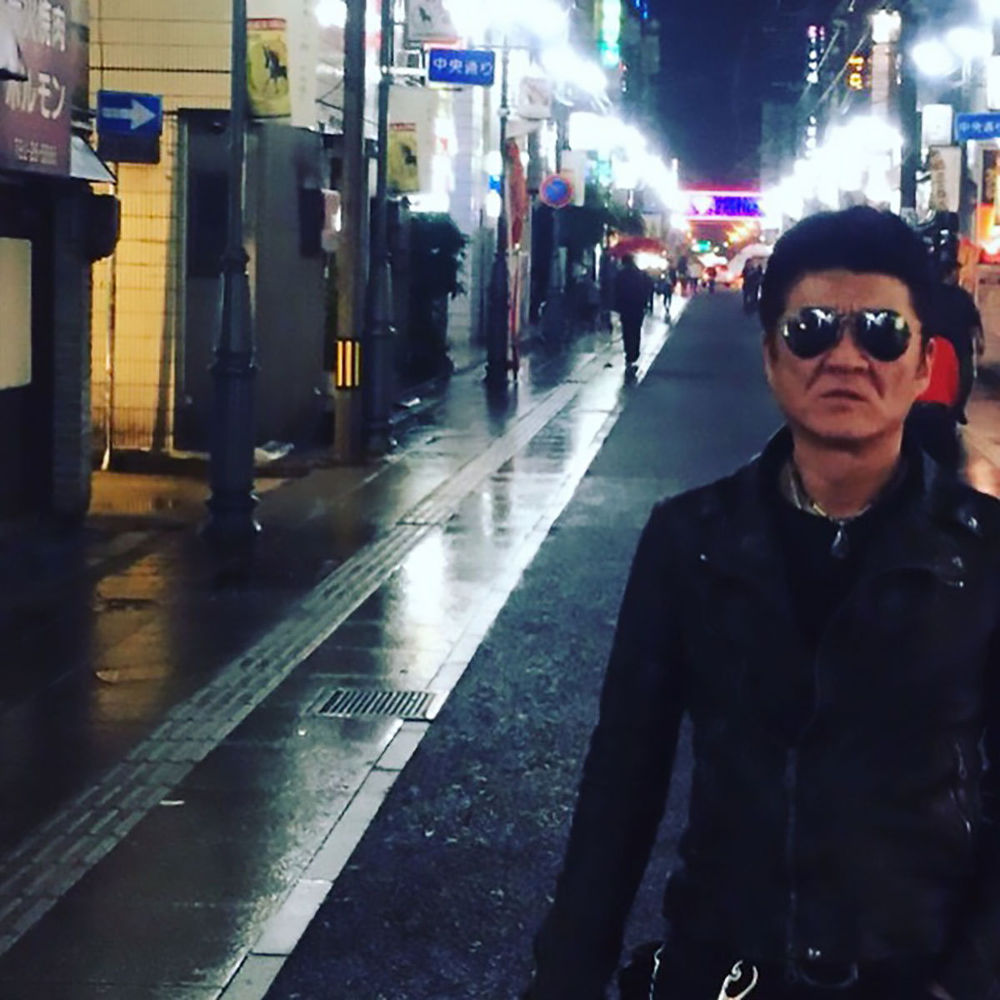
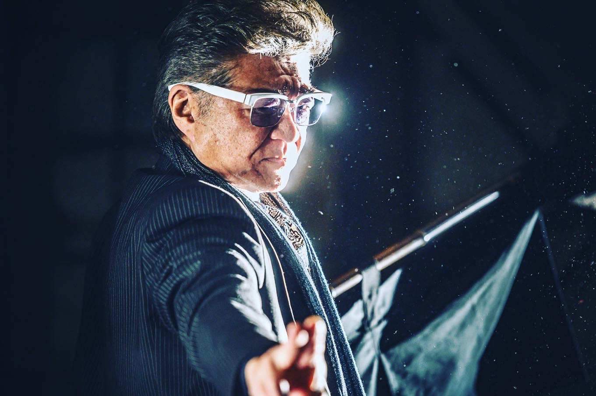
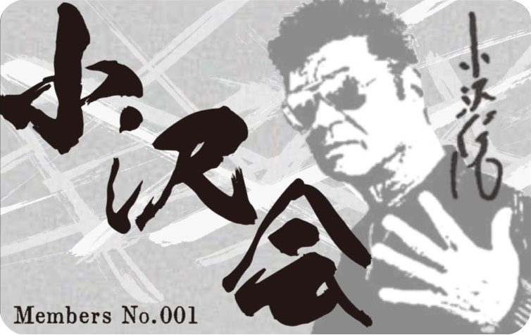

<!DOCTYPE html>
<html lang="ja">
<head>
<meta charset="utf-8">
<meta name="SKYPE_TOOLBAR" content="SKYPE_TOOLBAR_PARSER_COMPATIBLE">
<meta name="format-detection" content="telephone=no">
<meta name="viewport" content="width=device-width, initial-scale=1">
<title>小沢会オフィシャルサイト</title>
<meta name="keywords" content="小沢会,小沢仁志,公認,オフィシャルサイト,公式グッズ,会員">
<meta name="description" content="小沢仁志本人公認による公式の小沢会オフィシャルサイトです。小沢仁志のファンクラブではなく、小沢会を通じて様々な方々のご協力を賜り、今まで以上にチーム小沢を盛り上げていきたいと思います。公式のグッズの販売なども行っておりますので是非ご参加ください。">
<link rel="icon" href="favicon.ico" type="image/vnd.microsoft.icon">
<link rel="apple-touch-icon" href="apple-touch-icon.png">
<link rel="apple-touch-icon-precomposed" href="apple-touch-icon.png">
<link rel="stylesheet" href="css/bootstrap.min.css">
<link rel="stylesheet" href="css/replace.css">
<link rel="stylesheet" href="css/all.min.css"><!-- FontAwesome -->
<link rel="stylesheet" href="css/base.css">
<link rel="stylesheet" href="css/layout.css">
<link rel="stylesheet" href="css/ax.css">
<link rel="stylesheet" href="css/page.css">
<link rel="stylesheet" href="css/news.css">
<link rel="stylesheet" href="css/main-image.css">
<link rel="stylesheet" href="css/aos.css">
<link rel="stylesheet" href="css/bootstrap4-print.css">
<link rel="stylesheet" href="css/print.css">

</head>
<body>

	

	

	

	

	

	<h2 class="main-logo">
		<svg id="svg-animation" version="1.1" xmlns="http://www.w3.org/2000/svg" xmlns:xlink="http://www.w3.org/1999/xlink" x="0px" y="0px" viewBox="0 0 300 930" xml:space="preserve" width="300" height="930" class="copy-svg">
			<image xmlns:xlink="http://www.w3.org/1999/xlink" xlink:href="images/main-logo-a.png" width="300" height="930" mask="url(#clipmask)"></image>
			<mask id="clipmask" maskUnits="objectBoundingBox">
				<path style="stroke-miterlimit: 10;stroke-width: 52px" d="M125.32,43.99L168.83,93.61" class="st0"></path>
				<path style="stroke-linejoin: round;stroke-width: 52px" d="M150.51,93.61L140.59,133.31L140.59,164.6" class="st0"></path>
				<path style="stroke-miterlimit: 10;stroke-width: 39px" d="M139.82,184.45L148.04,221.09" class="st0"></path>
				<path style="stroke-linejoin: round;stroke-width: 49px" d="M154.33,224.15L152.8,247.05L125.32,278.34L90.97,241.7" class="st0"></path>
				<path style="stroke-linejoin: round;stroke-width: 49px" d="M60.44,197.43L42.12,226.44L65.78,232.54L98.6,199.72L178.76,171.47L218.45,167.66L249.75,194.37L260.44,210.41L176.47,224.15" class="st0"></path>
				<path style="stroke-miterlimit: 10;stroke-width: 67px" d="M55.09,353.92L90.84,377.92" class="st0"></path>
				<path style="stroke-miterlimit: 10;stroke-width: 51px" d="M26.98,460.26L65.02,435.6" class="st0"></path>
				<path style="stroke-miterlimit: 10;stroke-width: 15px" d="M48.22,469.95L38.3,515.75L39.06,537.88" class="st0"></path>
				<path style="stroke-miterlimit: 10;stroke-width: 44px" d="M45.17,575.29L74.94,485.98" class="st0"></path>
				<path style="stroke-linejoin: round;stroke-width: 11px" d="M77.23,471.47L140.59,375.29" class="st0"></path>
				<path style="stroke-linejoin: round;stroke-width: 25px" d="M136.77,381.4L194.02,334.07" class="st0"></path>
				<path style="stroke-linejoin: round;stroke-width: 58px" d="M172.65,347.57L220.74,360.02" class="st0"></path>
				<path style="stroke-linejoin: round;stroke-width: 58px" d="M266.54,369.95L187.76,435.41" class="st0"></path>
				<path style="stroke-linejoin: round;stroke-width: 58px" d="M178.76,442.81L163.64,454.13" class="st0"></path>
				<path style="stroke-linejoin: round;stroke-width: 58px" d="M170.36,383.69L112.34,495.9L76.47,599.72" class="st0"></path>
				<path style="stroke-linejoin: round;stroke-width: 58px" d="M161.2,468.42L202.42,529.49L260.44,564.6L180.28,588.27" class="st0"></path>
				<path style="stroke-linejoin: round;stroke-width: 58px" d="M156.09,656.02L94.28,708.94" class="st0"></path>
				<path style="stroke-linejoin: round;stroke-width: 25px" d="M92.44,727.91L17.98,854.68" class="st0"></path>
				<path style="stroke-linejoin: round;stroke-width: 25px" d="M19.98,859.26L52.33,836.07" class="st0"></path>
				<path style="stroke-linejoin: round;stroke-width: 48px" d="M167.49,660.79L181.81,705.82" class="st0"></path>
				<path style="stroke-linejoin: round;stroke-width: 43px" d="M186.39,721.86L230.66,784.45L260.44,801.24L268.83,778.34L242.12,719.57" class="st0"></path>
				<path style="stroke-linejoin: round;stroke-width: 43px" d="M121.5,733.6L153.56,743.23" class="st0"></path>
				<path style="stroke-linejoin: round;stroke-width: 9px" d="M126.85,750.86L106.24,766.13L94.02,785.98" class="st0"></path>
				<path style="stroke-linejoin: round;stroke-width: 25px" d="M84.1,785.21L68.83,818.04L81.81,826.43" class="st0"></path>
				<path style="stroke-linejoin: round;stroke-width: 52px" d="M90.97,820.33L183.34,768.11L188.68,783.69" class="st0"></path>
				<path style="stroke-linejoin: round;stroke-width: 49px" d="M100.13,829.49L81.81,861.55L106.24,877.58L161.2,849.34" class="st0"></path>
				<path style="stroke-linejoin: round;stroke-width: 49px" d="M159.67,814.99L202.42,832.54L238.3,858.5L171.12,885.98" class="st0"></path>
			</mask>
		</svg>
	</h2>

<header id="header" class="index">
	

		

			<h1 class="navbar-brand">
				<a href="index.html">
					
<!--
 					
					
 -->
 				</a>
			</h1>

			

				
<a href="https://lineblog.me/ozawahitoshi/" target="_blank" class="ico-sns"><i class="fa fa-blog"></i></a>

				
<a href="https://www.instagram.com/ozawa_hitoshi/" target="_blank" class="ico-sns"><i class="fab fa-instagram"></i></a>

				<nav class="navbar navbar-expand-lg">
					<button class="navbar-toggler" type="button" data-toggle="collapse" data-target="#navbar" aria-controls="navbar" aria-expanded="false" aria-label="Toggle navigation" tabindex="1" accesskey="3"><small>MENU</small></button>

					

						

							<ul class="navbar-nav">
								<li class="nav-item active"><a class="nav-link" href="index.html">Home<small>ホーム</small></a></li>
								<li class="nav-item"><a class="nav-link" href="profile.html">Profile<small>プロフィール</small></a></li>
								<li class="nav-item"><a class="nav-link" href="goods.html">Goods<small>グッズ販売</small></a></li>
                <?php echo $this->element('widgets/menu');?>
                <li class="nav-item"><a class="nav-link" href="contact.html">Contact<small>お問い合わせ</small></a></li>
							</ul>
						

					

				</nav>
			

		

	

</header>

<main id="wrapper">
<article id="main">
	

		

			

				

				

					

					

				

			

		

		

			

				
<strong>顔面凶器だけで終わらない</strong><strong>男らしさと優しさの2つの顔を持つ俳優</strong>

			

		

	

	

		

			

				<article class="sec-about bg-white">
					

						

							

								
							

							

								<h2 class="tit-lv0a">About<small>小沢会について</small></h2>

								<h3 class="tit-lv2">ご挨拶</h3>

								
この度小沢会ホームページを全面リニューアルいたしました。 会としても以前から、小沢仁志の活躍を陰ながら応援し支える活動をしてまいりましたが、その輪を広げていきたいという想いに、小沢仁志より公認を受け正式に小沢会（ファンクラブ）としての活動を本格的に開始する運びとなりました。 小沢仁志を応援するという志を持つ仲間をこのホームページで募集してまいりますので、今後ともよろしくお願いいたします。

								
<small>小沢会会長</small>　鈴木 貴子

							

						

					

				</article>

				<article class="sec-news">
					

						<h2 class="tit-lv0">News&amp;Events<small>ニュース ＆ イベント</small></h2>

						

							<ul class="nav nav-pills" id="myTab" role="tablist">
								<?php
								$icnt = 0;
								$categories = $this->requestAction(array('controller'=>'news','action'=>'navi'));
								foreach($categories as $category):
										$category = $category['CatalogCategory'];
										$cat_titles[$category['id']]=$category['title'];
										$cat_ids[$category['id']]=$category['id'];
									?>
								<li class="nav-item" role="presentation">
									<a class="nav-link<?php if ($icnt == 0):?> active<?php endif;?>" id="news<?php echo $category['id']?>-tab" data-toggle="tab" href="#news<?php echo $category['id']?>" aria-controls="news<?php echo $category['id']?>" aria-selected="true"><?php echo $category['title']?></a>
								</li>
								<?php
								$icnt++;
								endforeach;?>

							</ul>
							<?php
							$boxes = $this->requestAction(array('controller'=>'news','with_category' => 1,'action'=>'widget', 'order'=>array('CatalogBox.date1'=>'desc')));
							foreach($boxes as $box):
								extract($box['CatalogBox'],EXTR_PREFIX_ALL,'tbl');
								$cat_arr[$tbl_category_id][] = $box;
							endforeach;
							?>
							

								<?php
								$icnt = 0;
								foreach($cat_ids as $cat_id):
								?>
								
 active<?php endif;?>" id="news<?php echo $cat_id?>" role="tabpanel" aria-labelledby="news<?php echo $cat_id?>-tab">
									

										

											<?php
											if (!empty($cat_arr[$cat_id])):
											foreach($cat_arr[$cat_id] as $cat):
												extract($cat['CatalogBox'],EXTR_PREFIX_ALL,'tbl');
												extract($cat['CatalogCategory'],EXTR_PREFIX_ALL,'cat');
											?>
											

												

													
<?php echo date('Y/m/d', strtotime($tbl_date1));?><?php echo $this->Ezm->getNewMark($tbl_new_mark, $tbl_date1, '
NEW
');?>

													
;"><?php echo $cat_title;?>

												

												

													
<?php echo $tbl_html1;?>

												

												<!-- 詳細がない場合は.news-detailごと引っこ抜く -->
												<?php if ($tbl_has_page == 'Y'):?>
												
<a href="news/view/<?php echo $tbl_id;?>" class="axbtn ax-solid ax-sm arrow-right">MORE</a>

												<?php endif;?>
											

											<?php
												//使った変数を初期化
												foreach($box['CatalogBox'] as $key=>$data){
													${'tbl_'.$key} = null;
												}
											?>
											<?php
											$icnt++;

											endforeach;
											endif;
											?>

										

									

								

								<?php
								endforeach;
								?>

							

						

					

				</article>

				<article class="sec-item bg-white">
					

						

							

								
							

							

								<h2 class="tit-lv0a">NewItem<small>新着商品</small></h2>

								

									<?php

									$categories = $this->requestAction(array('controller'=>'goods','action'=>'navi','conditions'=>array('on_top_page'=>'Y')));
									foreach($categories as $category):
											$category = $category['CatalogCategory'];
											$cat_titles[$category['id']]=$category['title'];
											$cat_ids[$category['id']]=$category['id'];

										?>
									

										<?php if (!empty($category['image1'])):?>
										<a href="goods/index/<?php echo $category['id']?>" class="bg-contain bg-lightgray bg-4by3 bg-sm-4by3 bg-md-4by3 bg-lg-4by3 bg-xl-4by3 img-link">
											element('media', array('var'=>array('id'=>$category['image1'],'width'=>800,'return'=>true)))?>" width="1200" height="800" alt="">
										</a>
										<?php endif;?>
										<?php if (!empty($category['title'])):?>
										
<?php echo $category['title']?>

										<?php endif;?>
									

									<?php
									endforeach;?>
								

							

						

					

				</article>

				<article class="sec-member">
					

						

							

								
							

							

								<h2 class="tit-lv0a">Member<small>小沢会参加ご希望の方へ</small></h2>

								

									

										
【公式】小沢会オフィシャルサイトでは小沢仁志をサポートするだけに留まらず、オリジナル商品作りや、会を通しての社会貢献などを、会員の皆様と楽しく歩んでいきたいと考えております。

									

									

										
									

									

										<a href="registration.html" class="axbtn ax-outline ico-edit">会員登録</a>
									

								

							

						

					

				</article>

				<article class="sec-benefits bg-white">
					

						<h2 class="tit-lv0">Member Benefits<small>会員特典</small></h2>

						
会員へご登録いただけましたら会員限定オリジナルグッズを もれなく全員にプレゼントさせていただきます。

						
会員カードの発行や各種イベントへの招待などの特典があります。 今後も会員様特別特典を追加させていただく予定でおります。

					

				</article>
			

			<aside class="side-column"></aside>
		

	

</article>
</main>

<!-- footer -->
<footer id="fnav" class="pbb">
	<nav class="container">
		<ul class="fnav-menu">
			<li class="fnav-item"><a href="index.html" class="fnav-link">Home</a></li>
			<li class="fnav-item"><a href="profile.html" class="fnav-link">Profile</a></li>
			<li class="fnav-item"><a href="goods.html" class="fnav-link">Goods</a></li>
      <?php echo $this->element('widgets/menu_fut');?>
			<li class="fnav-item"><a href="contact.html" class="fnav-link">Contact</a></li>
		</ul>

		<ul class="fnav-btn">
			<li class="fnav-item"><a href="index.html" class="fnav-link ico-home">ホーム</a></li>
			<li class="fnav-item"><a href="contact.html" class="fnav-link ico-mail">お問合せ</a></li>
			<li class="fnav-item"><a href="#wrapper" class="fnav-link ico-top">先頭へ戻る</a></li>
		</ul>
	</nav>
</footer>

<footer id="footer">
	

		

			

				<h3 class="footer-brand"></h3>
				
小沢仁志公認ファンサイト

			

			

				

					
<a href="" target="_blank" class="fico-sns"><i class="fab fa-instagram"></i></a>

					

				

				
当サイトに掲載されている画像等の 無断転載は禁じます。

			

		

	

</footer>

<footer id="copyright"> 2020 小沢会</footer>

</body>
</html>
